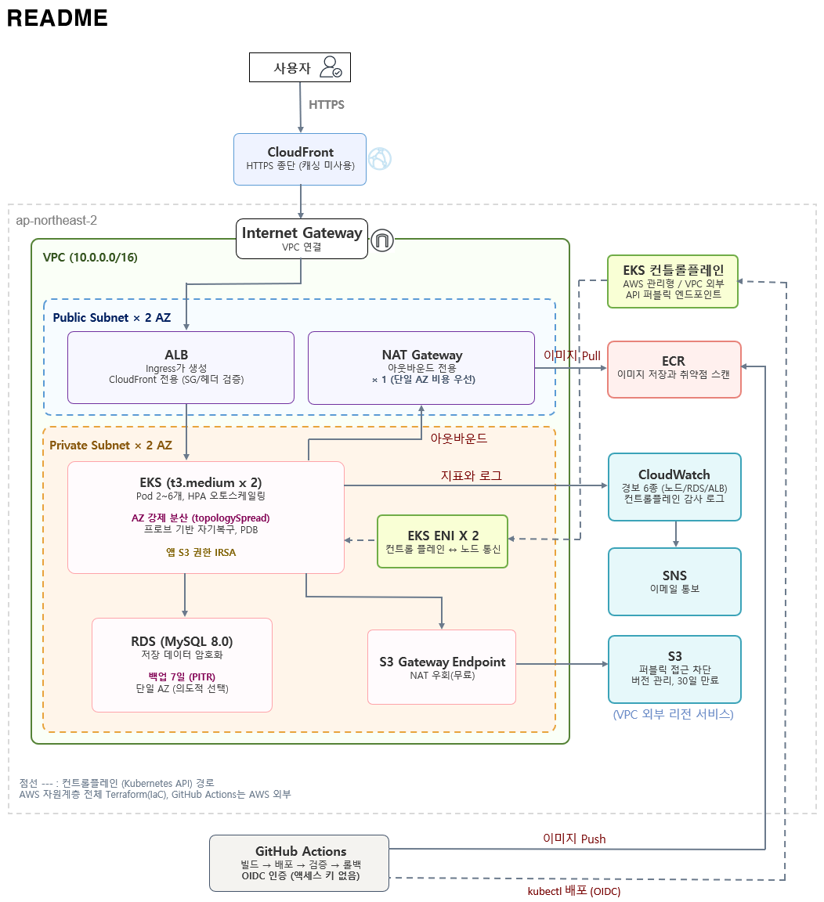

# 건강·복약 기록 서비스 기반 AWS 클라우드 인프라

> 온프레미스 운영 경험을 바탕으로 AWS 인프라를 처음부터 설계하고 구축한 프로젝트



# 요약
| | |
|---|---|
| 가용성 | Pod 2~6개 HPA, AZ 강제 분산, 프로브 자기복구 / 부하 테스트로 2 → 6개 확장 확인 |
| 자동화 | Push → 빌드 → 취약점 스캔 → 배포 → 검증 → 실패 시 자동 롤백이 약 1분 소요 |
| 보안 | 프라이빗 서브넷 격리, 저장 암호화, IRSA 최소 권한, OIDC 인증, 비root 컨테이너, CloudFront 전용 ALB |
| 검증 | 같은 코드로 재구축하며 확인하고 경보 발화와 SNS 수신 실측 |
| 비용 | 상시 가동 시 월 약 $236, 실제 청구 $6.47 (apply/destroy 반복) |

> 선택한 것보다 제외하는 부분들을 더 자세히 작성했습니다. [비용을 위해 감수한 것](#비용을-위해-감수한-것), [향후 개선](#10-향후-개선) 단원 참고
> 구축 중 겪은 문제와 판단 근거는 [docs/troubleshooting.md](docs/troubleshooting.md)로 별도 정리했습니다.

---

# 목차

1. [프로젝트 계기](#1-프로젝트-계기)
2. [개요와 목표](#2-개요와-목표)
3. [설계 의도](#3-설계-의도)
4. [기술 스택](#4-기술-스택)
5. [구축 내용](#5-구축-내용)
6. [검증](#6-검증)
7. [비용](#7-비용)
8. [실행 방법](#8-실행-방법)
9. [프로젝트 구조](#9-프로젝트-구조)
10. [향후 개선](#10-향후-개선)
11. [경력 연결](#11-경력-연결)

---

# 1. 프로젝트 계기

약 2년간 공공 대중교통 정산/실시간정보 시스템을 운영했습니다.
Linux/AIX 서버 38대와 네트워크, 보안, 스토리지, 백업을 운영하며
임계치 기반 모니터링으로 장애를 확인하고 1차 원인을 분석한 뒤,
조치 결과를 문서로 남기는 일이 주요 업무였습니다. 또한 CDC 기반 운영 DB → DR 복제 감시도 맡았습니다.

회사에서 개발팀의 C언어 기반 애플리케이션을 Docker로 통합해 NCP(Naver Cloud Platform) 서버로 테스트 환경을 구성하는 일이 있었습니다.
다만, 메인은 온프레미스 운영이었고 클라우드를 처음부터 설계하여 세우는 경험은 부족하다고 느꼈습니다.

> "모니터링하던 대상을 직접 만들어보는 것"이 프로젝트의 출발점입니다.
> 소재는 건강·복약 기록 서비스로 정했습니다. 민감 정보를 다루며 데이터 보호와 무중단을 함께 고민할 수 있어 적합했습니다.

---

# 2. 개요와 목표

- 건강·복약 기록 서비스를 EKS에 올리고 트래픽에 따른 자동 확장과 민감 정보 보호까지 Terraform으로 구축
- 인프라가 목적이므로 앱은 DB, S3 연동 확인용 최소 기능만 구현

| 구분 | 내용 |
|---|---|
| 재현 가능한 인프라 | AWS 자원 전체를 Terraform으로 콘솔 수동작업 없이 구현 |
| 끊기지 않는 운영 | Pod 다중화, 다중 AZ 강제 분산, HPA, 프로브 기반 자기복구 |
| 민감 정보 보호 | 네트워크 분리, 저장 암호화, 최소 권한(IRSA), CloudFront로만 진입 |
| 운영 가시성 | CloudWatch 경보 6종(노드, RDS, ALB), 컨트롤플레인 감사 로그 |
| 배포 자동화 | GitHub Actions OIDC를 통한 빌드 → 스캔 → 배포 → 검증 → 롤백 |

- IaC 범위는 AWS 자원 계층(VPC, RDS/S3, EKS, ECR, IAM, CloudFront, CloudWatch)
- 클러스터 안쪽(ALB Controller, metrics-server, Secret, ConfigMap)은 Helm과 kubectl 별도 관리
- Terraform `helm_release`로 통합하는 것도 보았으나 클러스터가 없는 시점에 provider 초기화 순서가 꼬여 destroy 시 자원이 남는 문제가 있어 두 계층 분류

## 기간
- 2026.06 ~ 2026.07 (구축) → 2026.08 (확인)
- 1인 개인 프로젝트

---

# 3. 설계 의도

1. 사용자 트래픽은 CloudFront로 들어옵니다. 개인 도메인 없이 기본 인증서로 HTTPS를 확보하고 ALB는 CloudFront 대역에서 오는 요청 중 검증 헤더가 맞는 것만 받습니다.
2. EKS 노드와 RDS는 프라이빗 서브넷 배치, S3는 퍼블릭 액세스 모두 차단합니다.
3. RDS는 EKS 노드 보안그룹에서 오는 3306만 허용하며 앱의 S3 읽기는 IRSA로 서비스 어카운트에만 부여하고 노드 역할에는 붙이지 않습니다.
4. '다중 AZ 무중단'을 문서로 두지 않고 `topologySpreadConstraints`로 강제합니다.
5. CloudWatch 경보 6종과 GitHub Actions로 관측 및 배포 자동화합니다.

※ CloudFront는 캐싱용이 아닌 동적 API만 다루므로 TTL 0으로 두고 HTTPS 종단 역할만 수행

## EKS 선택 사항 근거
| 대안 | 장점 | 배제 이유 |
|---|---|---|
| EKS (채택) | 실무 표준으로 이식성, HPA/자기복구 내장 | 컨트롤플레인 고정 요금 월 약 $72를 감수 |
| ECS Fargate | 컨트롤플레인 요금 없음, 노드 관리 불필요 | 해당 프로젝트 규모로 가장 적합하지만 실무 수요 Kubernetes에 집중 |
| EC2 + Docker Compose | 가장 단순하고 저렴 | 오토스케일링, 자기복구를 직접 구축해야 해 검증 목적과 어긋남 |

---

# 4. 기술 스택

| 구분 | 내용 |
|---|---|
| 클라우드 | AWS (ap-northeast-2) |
| 컨테이너 | Docker, ECR, EKS (Kubernetes v1.32), HPA |
| IaC | Terraform (AWS provider 5.x) |
| 데이터 | RDS (MySQL 8.0/암호화/백업 7일), S3 (비공개 버전 관리/이전 버전 30일 만료) |
| 네트워크 | VPC (공개/비공개 2AZ), NAT Gateway, S3 Gateway Endpoint, ALB, CloudFront |
| 인증·권한 | GitHub OIDC, IRSA, EKS Access Entry |
| 모니터링 | CloudWatch 경보 6종 + SNS, 컨트롤플레인 로그 |
| CI/CD | GitHub Actions |

---

# 5. 구축 내용

## 네트워크

1) VPC `10.0.0.0/16`에 퍼블릭과 프라이빗 서브넷 AZ 2곳 배치
2) EKS와 RDS는 프라이빗에 두고, 외부로 나가는 경로는 NAT Gateway 하나
3) 서브넷에 `kubernetes.io/role/elb` 태그를 달아 ALB Controller가 스스로 탐색
4) S3 Gateway Endpoint로 Pod → S3 트래픽이 NAT를 거치지 않게 함 (무료, NAT 처리 요금 절감)
5) ALB 전용 보안그룹은 CloudFront 관리형 프리픽스 리스트에서 오는 80만 허용

- `/16`으로 잡은 이유는 EKS의 VPC CNI가 Pod마다 VPC IP를 소비하기 때문입니다.

## 데이터

1) RDS(MySQL 8.0) 프라이빗 배치, 저장 암호화, 백업 7일(PITR), 백업 창은 한국 새벽시간 기준
2) 오류와 슬로우 쿼리 로그는 CloudWatch로 내보내기
3) RDS 보안그룹은 EKS 노드 보안그룹에서 오는 3306만 허용하고, 나가는 규칙은 두지 않음
4) S3는 퍼블릭 차단, 버전 관리, 이전 버전은 30일 후 만료

- MySQL은 회사에서 Docker 컨테이너 연동 경험 기반으로 선택했습니다.
- Multi-AZ는 비용이 두 배라 제외하였습니다. 그 대신 백업으로 복구 경로를 만들었습니다. (RTO 약 10~20분, RPO 최대 5분)

## 컨테이너 플랫폼

1) 공식 `terraform-aws-modules/eks`로 클러스터(v1.32) 구축, 노드 2대(상한 3대)
2) 컨트롤플레인 로그(api, audit, authenticator) 켜고 30일 보존
3) 앱 S3 권한은 IRSA로 서비스 어카운트에만 부여, 노드 역할에는 붙이지 않음
4) ECR `scan_on_push`, 파이프라인에서 CRITICAL이 하나라도 있으면 배포 중단
5) 컨테이너는 비root(uid 1000), 읽기 전용 루트 파일시스템, capabilities 모두 제거
6) 베이스 이미지는 `python:3.12-alpine`. 의존성이 전부 순수 파이썬이라 alpine으로 가도 문제없고, 패키지가 적어 취약점 노출면이 작음

## 외부 노출

1) Helm으로 ALB Controller 설치, Ingress로 ALB 자동 생성
2) ALB 앞에 CloudFront를 두고 Origin은 Terraform이 태그로 ALB를 찾아 연결하므로 재구축해도 주소를 따라감
3) Ingress 규칙 3개(`/health`, `/check`, `/`). `/health`는 외부 요청을 403으로 막으며 ALB 헬스체크는 리스너 규칙을 거치지 않으므로 영향 없음
4) 헬스체크 조건(15초 × 2회)을 기본값에 기대지 않고 코드 명시
5) ALB 직접 접근은 보안그룹에서 CloudFront 대역만 통과시키고, `X-Origin-Verify` 헤더까지 맞아야 앱에 도달

- 클러스터 API 엔드포인트는 퍼블릭입니다. GitHub Actions 러너 대역이 4,000개 넘게 있어 EKS CIDR 제한(40개)에 모두 넣지 못하고
self-hosted 러너는 상시 비용이 들어 IAM 인증과 Audit 로그를 추적하는 것으로 진행하게 되었습니다.

## 운영 안정성

1) HPA(CPU 50%, Pod 2~6개). 스케일 다운은 5분 안정화 창
2) topologySpreadConstraints로 Pod를 서로 다른 AZ에 강제 분산, 롤링 업데이트 중 종료되는 이전 버전 Pod까지 분산 계산에 포함되어
새 Pod가 한쪽에 몰리는 문제로 matchLabelKeys를 추가
3) readiness/liveness 프로브, PDB `minAvailable: 1`
4) `preStop` 20초, ALB 등록 해제 30초, `maxUnavailable: 0`, gunicorn graceful 30초로 롤링 교체 중 502 차단

- HPA 50%는 낮으면 과잉 증설, 높으면 대응이 늦어져 보수적으로 잡은 값입니다. 최소 2개는 다중 AZ 유지, 최대 6개는 비용 상한입니다.
- 노드 CPU 경보에 Maximum을 쓰는 이유는 평균이면 노드 A 92% / B 10%일 때 51%가 되어 한 노드 과부하를 놓칠 수 있습니다.
- 노드 70%는 HPA 50%와 2단 구조입니다. Pod 수준은 자동, 노드 자체가 70%를 넘으면 사람이 직접 확인해야 합니다.
- RDS 메모리 50MB는 관측한 값입니다. t3.micro는 MySQL이 버퍼로 대부분을 잡아 평상시 여유가 80~100MB라 그 아래로 잡았습니다.

| 경보 | 조건 | 관점 |
|---|---|---|
| 노드 CPU | > 70% (Maximum) | 서버 |
| RDS 여유 스토리지 | < 2GB | 데이터 |
| RDS 연결 수 | > 40 | 데이터 |
| RDS CPU | > 80%, 10분 연속 | 데이터 |
| RDS 여유 메모리 | < 50MB | 데이터 |
| ALB 5xx | 5분간 10건 초과 | 사용자 |

## 자동화

1) `app/` 변경 push → 빌드 → ECR 푸시 → 스캔 결과 확인 → 배포 → `rollout status` 검증 → 실패하면 `rollout undo`
2) GitHub Actions는 액세스 키 없이 OIDC로 역할을 넘겨받았고 EKS 권한은 Access Entry로 health-record 네임스페이스만 부여
3) 이미지 태그는 커밋 해시로 ECR은 IMMUTABLE이라 같은 태그를 덮어쓸 수 없고 수명주기로 최근 10개만 보관
4) 비밀값은 Kubernetes Secret, 환경 의존 값은 ConfigMap으로 분리해 저장소에 남기지 않음

---

# 6. 검증

## 부하 테스트

| 항목 | 결과 |
|---|---|
| Pod 수 | 2 → 6개 자동 확장 |
| Pod 강제 삭제 | 수 초 내 재생성과 지정 개수 유지 |
| 노드 CPU 경보 | 84% / 99%에서 발화, SNS 이메일 수신 |

상한 6개까지 확장된 뒤, 부하 제거 후 5분 안정화 창을 거쳐 2개로 축소되는 전 주기를 확인했습니다.


## 실측 확인

| 확인 | 결과 |
|---|---|
| CloudFront URL `/` | 200, JSON 응답 |
| CloudFront URL `/health` | 403 (외부 차단) |
| ALB 주소 직접 호출 | 응답 없음 (보안그룹 차단) |
| `/check/db`, `/check/s3` | connected (IRSA 및 보안그룹 동작) |
| Pod 배치 | 서로 다른 노드 AZ |
| GitHub Actions | OIDC 인증 성공, 스캔 CRITICAL 0, 배포 검증 통과 |

## 재구축

apply → 검증 → destroy를 한 사이클로 돌려 절차만으로 동일한 인프라가 재현되는지 확인했습니다.

---

# 7. 비용

상시 가동 시 월 예상 (서울 리전, 온디맨드)

| 항목 | 월 비용 |
|---|---|
| EKS 컨트롤플레인 | 약 $72 |
| EC2 노드 t3.medium × 2 | 약 $75 |
| NAT Gateway × 1 | 약 $43 |
| RDS db.t3.micro + 20GB | 약 $21 |
| ALB | 약 $18 |
| 기타 (EIP, 로그, CloudFront, S3, ECR) | 약 $7 |
| 합계 | 약 $236 |

실제 청구는 $6.47입니다. 전체가 코드라 작업 단위로 apply/destroy를 반복해 다시 세우는 부담이 없어 가능했습니다.

## 비용을 위해 감수한 것

| 선택 | 감수한 것 |
|---|---|
| NAT Gateway 단일 배치 | 프라이빗 라우팅 테이블을 두 AZ가 같이 쓰며 AZ-a 장애면 다른 AZ 외부 통신까지 끊김 |
| RDS 단일 AZ | 데이터 계층 단일 장애점 (백업으로 복구) |
| T계열 인스턴스 | CPU 크레딧 소진 시 스로틀링 |
| 필요 시 가동 | 시연 전 다시 세워야 함 |

---

# 8. 실행 방법

> AWS CLI 인증 - Terraform 1.5+ - kubectl 1.32 - Helm 3 - Docker

ALB는 Kubernetes가 생성하고 CloudFront는 Terraform이 만들어 apply를 두 번 나눕니다.

① 변수 파일
```
cp terraform.tfvars.example terraform.tfvars
```
`db_password`, `alert_email`, `github_repo`, `cloudfront_origin_secret` 채우고 `alb_created = false`

② 1회차 apply
```
terraform init && terraform apply
```

③ 클러스터 연결, ALB Controller, metrics-server
```
aws eks update-kubeconfig --region ap-northeast-2 --name health-record-eks
kubectl create serviceaccount aws-load-balancer-controller -n kube-system
kubectl annotate serviceaccount aws-load-balancer-controller -n kube-system \
  eks.amazonaws.com/role-arn=$(terraform output -raw alb_controller_role_arn)
helm repo add eks https://aws.github.io/eks-charts
helm install aws-load-balancer-controller eks/aws-load-balancer-controller -n kube-system \
  --set clusterName=health-record-eks --set serviceAccount.create=false \
  --set serviceAccount.name=aws-load-balancer-controller --set region=ap-northeast-2
kubectl apply -f https://github.com/kubernetes-sigs/metrics-server/releases/latest/download/components.yaml
```

④ 첫 이미지 (최초 1회 수행하고 이후 CI/CD)
```
ECR=$(terraform output -raw ecr_repository_url)
docker build -t $ECR:v1 ./app && docker push $ECR:v1
```

⑤ 매니페스트 값 채우기: 에디터에서 직접 수정 (커밋하지 않음)
- `k8s/serviceaccount.yaml` `<APP_ROLE_ARN>` ← `terraform output app_irsa_role_arn`
- `k8s/ingress.yaml` `<ALB_SG_ID>` ← `terraform output alb_security_group_id`, `<ORIGIN_SECRET>`  tfvars 값
- `k8s/deployment.yaml` `<ECR_REPOSITORY_URL>:<IMAGE_TAG>`  ④번 과정의 주소와 태그

⑥ 배포
```
kubectl apply -f k8s/namespace.yaml -f k8s/serviceaccount.yaml
kubectl -n health-record create configmap app-config \
  --from-literal=DB_HOST=$(terraform output -raw db_endpoint) \
  --from-literal=DB_NAME=healthrecord --from-literal=DB_USER=admin \
  --from-literal=S3_BUCKET=$(terraform output -raw s3_bucket)
kubectl -n health-record create secret generic db-secret --from-literal=password=<DB비밀번호>
kubectl apply -f k8s/deployment.yaml -f k8s/hpa.yaml -f k8s/ingress.yaml
kubectl -n health-record get pods -o wide
```

⑦ 2회차 apply — `kubectl -n health-record get ingress`에 ADDRESS가 뜨면 `alb_created = true`로 바꾸기
```
terraform apply
```
출력된 cloudfront_url로 / 200, /health 403, /check/db, /check/s3를 확인합니다. ALB 주소 직접 호출은 차단됩니다.

⑧ GitHub — 저장소 Secrets에 `AWS_ROLE_ARN` ← `terraform output github_actions_role_arn`

⑨ 정리 (순서 중요)
```
kubectl delete -f k8s/ingress.yaml  # ALB 우선
# 1~2분 후 alb_created = false로 되돌리기
terraform destroy
```

---

# 9. 프로젝트 구조

```
health-record-infra/
├── provider.tf                    # Terraform·AWS provider, 공통 태그
├── variables.tf                   # 변수 선언 (값은 tfvars, 커밋 제외)
├── vpc.tf                         # VPC/Subnet 2AZ, NAT, S3 Endpoint, ALB 보안그룹
├── storage.tf                     # RDS와 S3
├── eks.tf                         # EKS, 노드그룹, Access Entry, 앱 IRSA
├── alb-controller.tf              # ALB Controller IRSA, ALB 조회
├── github-oidc.tf                 # GitHub Actions OIDC 역할과 정책
├── ecr.tf                         # ECR (IMMUTABLE, 스캔, 수명주기 10개)
├── cloudfront.tf                  # CloudFront (2회차 Apply)
├── monitoring.tf                  # CloudWatch 경보 6종과 SNS
├── outputs.tf                     # 매니페스트와 GitHub 설정에 쓰는 출력값
├── terraform.tfvars.example
│
├── k8s/
│   ├── namespace.yaml
│   ├── serviceaccount.yaml        # IRSA 연결
│   ├── deployment.yaml            # Pod 2개, AZ 분산, 프로브, PDB
│   ├── hpa.yaml                   # CPU 50%, 2~6개
│   └── ingress.yaml               # ALB, 경로 규칙, CloudFront 전용
│
├── app/                           # 연동 확인용 Flask 최소 앱
│   ├── app.py
│   ├── Dockerfile                 # alpine, 비root
│   └── requirements.txt           # 버전 고정
│
├── .github/workflows/deploy.yaml  # OIDC → 빌드 → 스캔 → 배포 → 검증 → 롤백
├── docs/
│   ├── architecture.png
│   └── troubleshooting.md         # 트러블슈팅 및 의사결정 기록
├── .gitattributes / .gitignore
└── .terraform.lock.hcl
```

---

# 10. 향후 개선

학습용으로 단순하게 구성했습니다. 운영 전환 시 개선 순위는 다음과 같습니다.

| 순위 | 항목 | 현재 |
|---|---|---|
| 1 | CloudFront 구간 TLS 정비 (ACM 인증서 적용) | 커스텀 도메인이 없어 CF→ALB 평문 HTTP. 뷰어 구간도 기본 인증서라 최소 TLS가 TLSv1 고정(1.0/1.1 허용) |
| 2 | Pod와 RDS 구간 사이 TLS | 평문 |
| 3 | Container Insights로 Pod 지표/로그 | 노드 경보만으로 앱 계층 이상 확인 불가 |
| 4 | Terraform 상태 S3 + DynamoDB 원격 백엔드 | 로컬 상태 파일 |
| 5 | RDS 마스터 비밀번호 Secrets Manager 관리 전환 | `var.db_password`로 주입되어 tfvars와 상태 파일에 평문 기록 |
| 6 | Argo CD 선언형 배포 | `kubectl set image` 명령형, 매니페스트와 클러스터 상태 어긋남 |
| 7 | ALB 액세스 로그, VPC Flow Logs | 미적용 |
| 8 | NAT Gateway AZ별 배치 | 단일 (비용 우선) |
| 9 | EKS API 엔드포인트 프라이빗 전환 | 퍼블릭 (러너 대역 제한 불가) |
| 10 | metrics-server·ALB Controller 코드화 | Helm/kubectl 수동 |
| 11 | HPA 임계값 부하 테스트 기반 재조정 | 보수적 초기값 |

---

# 11. 경력 연결

아래 항목은 모두 운영 중 경험한 설계 판단의 근거가 되었습니다.

| 운영자 관점 | 새로운 구축 관점 |
|---|---|
| 서버 이상 징후 감지와 1차 대응 | 지표와 경보 6종을 직접 설계 |
| 솔루션 컨테이너화의 동작 검증 | EKS에서 다중화, AZ 분산, 자기복구 |
| 임계치 관측과 알람 판별 | 기준선을 먼저 재고 임계값을 정함 (RDS 메모리 경보) |
| 메모리 알람에서 세션 초과 특정 | RDS 연결 수와 메모리 경보 |
| 로그 적체로 파일시스템 포화 | RDS 여유 스토리지 경보, S3 이전 버전 만료 |
| TSM 백업 일일 점검 | RDS 백업 7일과 PITR을 코드로 구현하며 RTO/RPO 수치화 |
| CDC 운영 → DR 복제 감시 | Multi-AZ 가치를 알면서 의도적으로 제외하고 백업 복구 경로 대체 |
| Agent Dead 알람 직접 복구 | 프로브와 PDB로 감지/복구를 코드로 맡음 |

노드 CPU가 정상이지만 장애가 나는 경우를 2년간 반복적으로 겪으며 인프라 지표로는 부족하다 보고 데이터/사용자 계층 경보를 도입했습니다.
